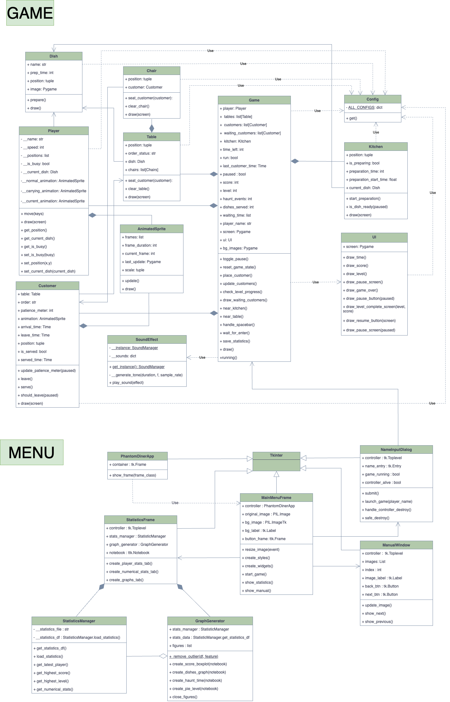

# Phantom Diner
## 1. Project Overview
In Phantom Diner, players act as a ghost waiter in a haunted diner. Ghostly customers arrive at tables, place orders, and wait for their food. The player must take orders and  deliver dishes before the customers lose patience. The game rewards speed with points, and players advance to the next level by meeting score targets.

**Mechanics:**

**Ghost Customers:**  
* Arrive at random tables and place orders for spooky dishes.
* Have a "patience meter" that decreases over time. The patience meter decreases by 5% per level until it reaches the minimum patience decrease. This will ensure that the game remains challenging but fair at higher levels.  
**Player Actions:** 
* Take orders and deliver dishes.  
* Earn points for serving customers quickly (10 points per serving).  
Score and Level Progression:
* Players must achieve a minimum score (e.g., 100 points) to advance to the next level.
* Each level lasts 1 minute, with the timer increasing by 10 seconds every fourth level.  
**Kitchen Mechanics:**
* Players must go to the kitchen to prepare dishes.
* Dishes take a fixed time to prepare (e.g., 3 seconds).  
**Haunt Events:**
* If a customer’s patience meter reaches zero, they leave, and the player loses points.

**Functionality:**  
**Real-Time Gameplay:**  
* Multiple ghost customers arrive and place orders.  
**Visual Feedback:**  
* Patience meters, orders, and waiting customers are displayed.  
**Score Tracking and Level Progression:**  
* Players earn points for serving customers quickly.  
* Players must meet score targets to advance to the next level.  

## 2. Project Review
**Existing Project:**  
Diner Dash  is a popular time-management game where players act as a waitress in a busy diner.
**Improvements :**  
**Simplified Mechanics:**  
Focus on core gameplay: serving dishes and managing customer patience.
**Statistical Tracking:**  
Track key metrics like score, waiting time, dishes served, and haunt events.
Analyze player performance using visualizations (e.g., bar charts, line graphs).
**Level Progression with Score Targets:**  
Players must achieve a minimum score (e.g., 100 points) within a time limit to advance.  
**Haunt Events:**  
Customers leave if their patience runs out, and the player loses points.
**Supernatural Theme:**  
Replace human customers and dishes with ghostly customers and spooky dishes.

## 3. Programming Development
### 3.1 Game Concept
**Objectives**  
Serve Customers Quickly:
Take orders and deliver dishes before customers lose patience.
Earn Points:
Score points by serving customers quickly.
Advance Through Levels:
Achieve the minimum score within the time limit to unlock the next level.
Avoid Haunt Events:
Prevent customers from leaving by serving them before their patience runs out.

**Key Features:**
Ghost Customers:
Arrive at random tables and place orders.
If no tables are available, customers wait in line.
Player Actions:
Move to the kitchen to prepare dishes.
Pick up and serve dishes to customers.
Patience Meter:
Customers have a patience meter that decreases over time.
If it reaches zero, they leave, and the player loses points.
Score System:
Players earn points for serving customers quickly.
A minimum score (e.g., 100 points) is required to advance to the next level.
Time-Limited Levels:
Each level lasts 1 minute, with the timer increasing by 10 seconds every fourth level.
Queue System:
Customers wait in line if all tables are full.
A random customer arrives every 5 seconds.
Visual Feedback:
Display customer patience meters and orders.
Show waiting customers at the bottom left of the screen.

### 3.2  Object-Oriented Programming Implementation
1. **Player**  
Role: Represents the ghost waiter.  
2. **Customer**  
Role: Represents a ghost customer at a table.
3. **Table**  
Role: Represents a table in the haunted diner.
4. **Chair**  
Role : represents a chair at a table.
5. **Dish**  
Role: Represents a dish that can be served.
6. **Game**  
Role: Manages the overall game state.
7. **Kitchen**  
Role: Represents the kitchen area where dishes are prepared.
8. **Config**  
Role: Keep the constants used in the game.
9. **AnimatedSprite**  
Role: handles the animation of sprites by loading and displaying a sequence of frames.
10. **UI**  
Role : handles the user interface, including displaying the score, time, and level.
11. **SoundEffect**  
Role : handles the sound of the game
12. **PhantomDinerApp**  
Role : Contains the main game container, Manages frame switching between different views
13. **MainMenuFrame**  
Role : Main menu screen, Provides buttons to start game, view stats, manual, or quit
14. **NameInputDialog**  
Role : Modal dialog for player name input, Launches the Pygame game window, Bridges Tkinter and Pygame interfaces
15. **StatisticsFrame**  
Role : Displays game statistics in tabbed view,Shows player stats, overall stats, and graphs
16. **StatisticsManager**  
Role : Manages game statistics data, Loads/saves CSV data, Calculates aggregates (max scores, averages, etc.)
17. **GraphGenerator**  
Role : Creates visualization plots, Handles boxplots, bar charts, scatter plots, and pie charts
18. **ManualWindow**  
Role : Interactive game manual, Shows image-based instructions, Navigation between manual pages

### 3.3 Algorithms Involved
1. Timer-Based Mechanics:  
Each level lasts 1 minute, with the timer increasing by 10 seconds every fourth level.
Customers have a patience meter that decreases over time.    
2. Randomization:  
Ghost customers arrive at random tables.  
3. Event-Driven Logic:  
Player actions (e.g., taking orders, serving dishes) trigger updates to the game state.  
4. Level Progression Mechanic:  
Players must score at least 100 points within the time limit to proceed to the next level.

## 4. Statistical Data (Prop Stats)
###  4.1 Data Features
**Score:**  
Tracks the player’s score over time (per level).
**Waiting Time:**
Records the average waiting time in seconds across all customers in the session (average per level).
**Haunt Events:**
Number of times customers leave due to low patience (per level).
**Dishes Served:**
Records the total number of dishes served (per level).
**Level:**
Tracks the current level of the player.
**Player’s Name:**
The name of the player.
### 4.2 Data Recording Method
Data will be stored in a CSV file.  
Example CSV structure:  
Player,Score,Waiting Time,Haunt Events,Level,Dish Served
Player1,300,10.50,5,16,50
Player2,100,10,10,3,30

### 4.3 Data Analysis Report

#### Statistical Data Revision
| Feature        | Why is it good to have this data?                                                                 | How to obtain 50 values?                                                       | Variable (and Class)              | How to display                                                                                                          |
|----------------|--------------------------------------------------------------------------------------------------|--------------------------------------------------------------------------------|-----------------------------------|-------------------------------------------------------------------------------------------------------------------------|
| **Score**       | Reflects player performance and progression. Helps analyze how well the player is doing.         | Collect the score when completing one level or quitting early.                 | `score` (from the `Game` class)   | **Statistics Table**: mean, median, min, max, std dev **Graph**: Boxplot distribution per level                      |
| **Waiting Time**| Measures customer satisfaction and player’s efficiency. Identifies gameplay bottlenecks.         | Record the waiting time for each customer and calculate the average per level. | `waiting_times` (from `Game`)     | **Statistics Table**: mean, median, min, max, std dev **Graph**: Scatter plot vs. haunt level                        |
| **Haunt Events**| Tracks how often customers leave due to low patience. Indicates time management efficiency.       | Count the number of haunt events per level.                                    | `haunt_events` (from `Game`)      | **Statistics Table**: mean, median, min, max, std dev **Graph**: Scatter plot vs. waiting time                       |
| **Dishes Served**| Measures productivity and efficiency. Analyzes how many dishes are served.                      | Record the cumulative number of dishes served per level.                       | `dishes_served` (from `Game`)     | **Statistics**: mean, median, min, max, std dev **Graph**: Bar graph of average dishes served per level              |
| **Level**        | Tracks progression and difficulty scaling. Reflects player skill.                               | Record the level reached when completing or quitting.                          | `level` (from `Game`)             | **Statistics Table**: Highest level reached **Graph**: Boxplot (score-level), Bar (dishes-level), Pie (player-level) |
| **Player's Name**| Personalizes game experience. Tracks individual performance.                                    | Collect at the start of the game.                                              | `player_name` (from `Game`)       | **Statistics Table**: Player with highest score and highest level                                                       |

#### Table
Display the player with the highest score and score of current player

#### 1. Player Score Table
|                | Name  | Score   |
|----------------|-------|---------|
| Highest player | Fah   | 190     |

#### 2. Player Level Table
|                | Name | Level |
|----------------|------|-------|
| Highest player | CP   | 35    |

#### 3. Statistical Data of Game

| Feature       | Statistical Value                          |
|---------------|--------------------------------------------|
| Score         | Mean, Median, Standard Deviation, Min, Max |
| Waiting Time  | Mean, Median, Standard Deviation, Min, Max |
| Haunt Events  | Mean, Median, Standard Deviation, Min, Max |
| Dishes Served | Mean, Median, Standard Deviation, Min, Max |

### Graph

| Feature Name                             | Graph Objective                        | Graph Type   | X-axis         | Y-axis                   |
|------------------------------------------|----------------------------------------|--------------|----------------|--------------------------|
| Boxplot of score                         | Show score distribution across levels  | Boxplot      | Level          | Score                    |
| Bar graph of dishes served per level     | Show dish volume across levels         | Bar graph    | Level          | Average dishes per level |
| Scatter plot between Haunt and wait time | Analyze haunt-wait time relationship   | Scatter Plot | Waiting time   | Haunt events count       |
| Level Progression Pie Chart              | Show level progression rate            | Pie Chart    | Level reached  | % of players             |

## 5. Project Timeline  
| Week         | Task                                         |
|--------------|----------------------------------------------|
| 1 (10 March) | Proposal submission / Project initiation     |
| 2 (17 March) | Full proposal submission                     |
| 3 (24 March) | Add data collected table                     |
| 4 (31 March) | Statistical Revision and planning submission |
| 5 (7 April)  | Create graph and statistical table           |
| 6 (14 April) | Submission week (Draft)                      |

### Planning submission
| Week              | Goals                                                                                   |
|-------------------|------------------------------------------------------------------------------------------|
| 26 March - 2 April| - Complete all game logics - Collect statistical data - Create statistical table  |
| 3 April - 9 April | - Decorate game and develop visualization - Implement 2 graphs and put in Tkinter    |
| 10 April - 16 April| - Implement all graphs and put in Tkinter - Develop project - Submit draft        |
| 17 April - 23 April| - Revise project - Complete game project - Complete documentation                 |
| 24 April - 11 May | - Submit project                                                                         |

## 6. Document version
Version: 6.0
Date: 11 May 2025

## 7. Source and credit
- images : 
  - Player and Customer : Get inspired by [DEADPIXELS](https://www.deadpixels.club/)
  - Background : Get inspired by Diner Dash background
- code:
  - Get inspired by Diner Dash 

## 8. The different from Proposal 4
- Features : Completing all key features and functionality.
- OOP : Adding more classes. The final version has 18 classes.
- Statistical data : Adjust the table by only showing Mean, Median, SD, Min, Max of score, Waiting time, Haunt Events and Dish served.

