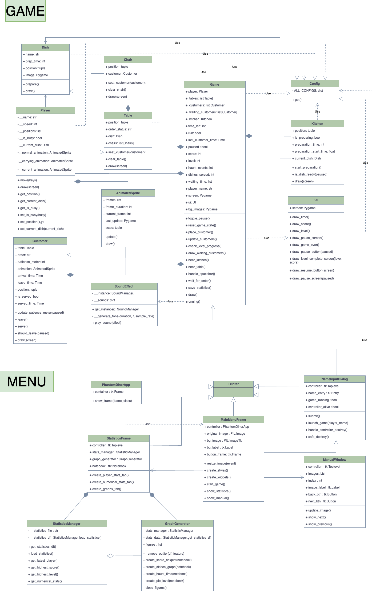

# PHANTOM DINER

In Phantom Diner, players act as a ghost waiter in a haunted diner. 
Ghostly customers arrive at tables, place orders, and wait for their food. 
The player must take orders and deliver dishes before the customers lose patience. 
The game rewards speed with points, and players advance to the next level by meeting score targets.

## HOW TO PLAY
* **Move** with Arrow Keys ← ↑ → ↓
* **Interact** with SPACEBAR (Pick up dish and Serve customer):  
  1. Start cooking at kitchen  
  2. Pick up prepared dishes  
  3. Serve customers  
* Watch customer patience meters  
* Complete levels before time runs out!

## Installation

### clone the respository

``` git clone https://github.com/primpunnapa/phantom_dinner.git```

### Recommended: Using Virtual Environment
1. **Create and activate virtual environment**:
    ```bash
    # Windows
    python -m venv venv
    venv\Scripts\activate
    
    # macOS/Linux
    python3 -m venv venv
    source venv/bin/activate

2. **Requirement**:
   - Python 3.11+
   - Packages:
     - pygame 2.6+
     - matplotlib 
     - seaborn 
     - pandas
     - numpy
     - pillow

3. **Install dependencies**:
    ```bash
    pip install -r requirements.txt
   
4. **Run the game**:  
    ```bash
    python main.py

### UML


